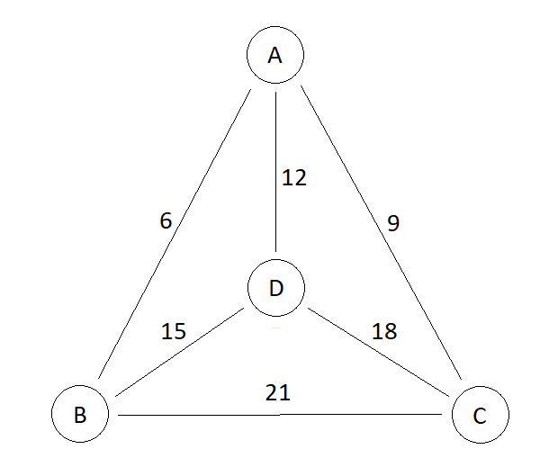

# Traveling Salesman Problem

## Task
Find the cheapest way to visit all the cities and return to your starting point. 

  
Graph with finite number of points and the cost of travel between each pair. The travel costs are symmetric (there are direct and reverse paths between 2 nodes). The goal is to find a Hamiltonian cycle with the minimum total weight.  
Create a table with named nodes using structure {point1, point2, cost} and fill data based on a picture.  
Write a SQL statement that returns all tours with minimum travel cost if we start from city "A".  